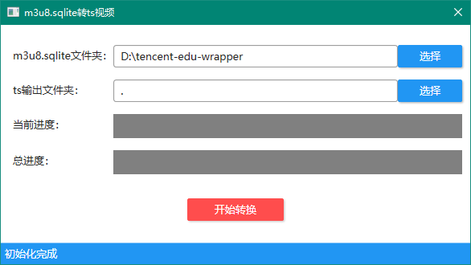
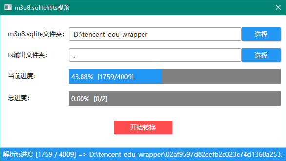
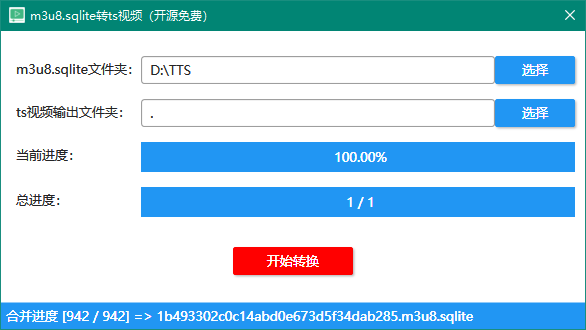
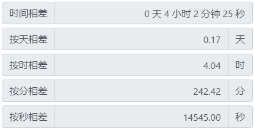

# m3u8.sqlite文件转视频工具.net wpf版本

## 发行版zip包在[gitee](https://gitee.com/liulei901112/txkt_m3u8.sqlite_ts)下，[github](https://github.com/liulei901112/txkt_m3u8.sqlite_ts)只是同步了代码

## New Tips
很多小伙伴反馈新版本的无法解码（日志提示：file is not a database），代码仓库提供6.3.5.3版本的apk下载。这个版本的app下载的文件是可以解码的。并且兼容多账号合并后的课程浏览问题（比如：手机号登陆、微信、QQ登陆场景，再之前的版本就不支持了）。再后边的版本我就没做测试了

#### 软件介绍
基于.net实现的m3u8.sqlite文件转视频工具。
虽然已有另一个python开源版本，但是对python不熟悉的朋友操作不是很友好。
所以开发这个客户端的版本，让其操作更为便捷。
转换后的视频是.ts的文件，需要转mp4或其他格式的可以下载格式工厂，或者自行选择其他转换工具就ok了。
因apk客户端版本不同下载的文件可能会无法解码，请看文档最后。

#### 软件架构
本地单机软件
* WPF实现的UI（RubyerUI组件）

#### 安装教程
* 运行环境基于.net freamwork 4.6（win10默认带，精简版可能不带哦）
* 发布版下载解压可用（或自己下载源码编译）

#### 软件截图

#### 流程演示

#### 性能测试
整理了108个m3u8.sqlite文件，累计91G。读取和写入均为机械硬盘，但是不是同一个盘。单线程测试基于1.0.2版本，多线程基于1.0.6版本。测试结果如下：

【单线程】 

【多线程】

注意：多线程版本是全量读取单个文件的内容，如果文件大于2G，可能会OOM（转换失败），转换文件大于2G的建议下载1.0.2版本。1.0.6版本中的OOM问题会在后续版本修正。

#### 使用说明
1. 选择m3u8.sqlite文件所在文件夹（源文件）
2. 选择解码后的ts文件输出文件夹（目标文件夹）
3. 点击“开始转换”按钮，等待转换结束吧

#### 参考项目
[tencent-edu-wrapper](https://github.com/r00t1900/tencent-edu-wrapper)

#### 仓库地址
* [github](https://github.com/liulei901112/txkt_m3u8.sqlite_ts)
* [gitee](https://gitee.com/liulei901112/txkt_m3u8.sqlite_ts)

#### 可能出现的错误
1. 提示文件损坏（metadata解析错误）
   * 原因1：下载文件损坏
   * 方案1：重新下载文件
   * 原因2：传输过程导致文件损坏（传输前后文件大小不一致或损坏）
   * 方案2：可以把文件放入新文件夹，压缩后传输。感谢@cz777。也可采用方案1重新下载
2. 提示文件损坏（file is not a database -> 不是一个数据库文件）
   * 原因：新版的app下载的文件数据加密了，无法解析。
   * 方案：下载发行版附件：txkt_6.3.5.3.apk，也可以使用仓库中的apk。（我个人使用的这个版本，是可以正常解码的）
3. 其他问题：可以在仓库或您看到的文章下留言（也可以wx：liulei901112，mail：liulei901112@163.com），我看到会回复您的，分析问题，尽力解决问