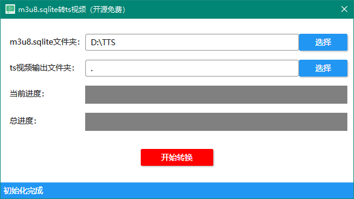
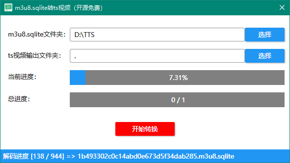

# m3u8.sqlite文件转视频工具.net wpf版本

#### 软件介绍
基于.net实现的m3u8.sqlite文件转视频工具。
虽然已有另一个python开源版本，但是对python不熟悉的朋友操作不是很友好。
所以开发这个客户端的版本，让其操作更为便捷。
转换后的视频是.ts的文件，需要转mp4或其他格式的可以下载格式工厂，或者自行选择其他转换工具就ok了。
因apk客户端版本不同下载的文件可能会无法解码，请看文档最后。

#### 软件架构
本地单机软件
* WPF实现的UI（RubyerUI组件）

#### 安装教程
* 运行环境基于.net freamwork 4.6（win10默认带，精简版可能不带哦）
* 发布版下载解压可用（或自己下载源码编译）

#### 软件截图

#### 使用说明
1. 选择m3u8.sqlite文件所在文件夹（源文件）
2. 选择解码后的ts文件输出文件夹（目标文件夹）
3. 点击“开始转换”按钮，等待转换结束吧

#### 参与贡献
1. [tencent-edu-wrapper](https://github.com/r00t1900/tencent-edu-wrapper)

#### 仓库地址
* [github](https://github.com/liulei901112/txkt_m3u8.sqlite_ts)
* [gitee](https://gitee.com/liulei901112/txkt_m3u8.sqlite_ts)

#### 可能出现的错误
* metadata解析时卡住或死掉了
   1. 原因：可能是因为新版的app下载的文件数据格式加密，无法解析。也可能是文件损坏。
   2. 解决办法：下载仓库中的txkt_6.1.0.138.apk（这个版本是我使用的版本，下载的文件是可以正常解码的）
   3. 其他问题：可以在仓库或者您看到的文章下留言。我看到会回复并联系您，分析并解决问题。
